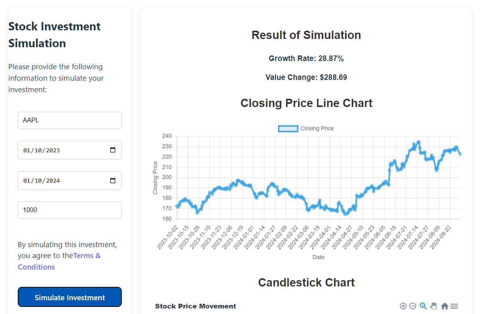

# Stock Investment Simulation Frontend

The **Stock Investment Simulation Frontend** is an application developed in React that allows users to simulate the performance of stock investments over time. The application collects historical stock price data from a Python Backend API and presents both line charts and candlestick charts to visualize the growth or decrease of investments over a given period.

The main goal is to provide users with an intuitive and a learning devs tool to:

- Visualize the historical performance of a specific stock using interactive charts.
- Calculate and display the growth or decrease rate of an investment based on historical data.
- Enable visual analysis of market trends for investment decision-making.

This project is the frontend application for the **Stock Investment Simulation App**.

The app allows users to enter a stock symbol, an investment start and end date, and investment initial value to simulate investment growth or decline using historical stock price data.



## Overview

The frontend is built using **React** and utilizes charting libraries such as **Chart.js** and **ApexCharts** to visualize historical stock price data interactively, including line charts and candlestick charts .

## Technologies

- **React**: Frontend framework for building user interfaces.
- **Chart.js**: Chart library for visualizing financial data with line graphs.
- **ApexCharts**: Chart library for visualizing financial data with candlestick charts.
- **Axios**: Library for making HTTP requests to the backend.
- **CSS3**: Styling and responsive layout.

## Installation

Follow the steps below to set up the project on your local machine:

### Prerequisites

- **Node.js** (recommended version: 14.x or higher)
- **npm** (Node Package Manager) or **yarn** for package management
- **Backend APIs** The backend for the project is available at https://github.com/fnldesign/stock-simulator-backend.git

### Installation

1. Clone the repository to your local machine:

```bash
git clone https://github.com/fnldesign/stock-simulator-frontend.git
cd stock-investment-simulation-frontend
``` 

2. Install project dependencies:

```bash
npm install
# or
yarn install
```

3. Executing the Project

To run the project in development mode:

```bash
npm run dev
# or
yarn run dev
```

## Folder Structure
Below is the basic folder structure of the project:

```graphql
src/
├── components/ # Reusable React components
│ ├── SimulationForm.jsx # Form for inserting simulation data
│ ├── SimulationResults.jsx # Display of simulation results
│ ├── ApexCandlestickChart.jsx # Candlestick chart using ApexCharts
│ ├── LightweightCandlestickChart.jsx # Candlestick chart using TradingView
│ ├── StockChart.jsx # Line Chart using Chart.js
├── pages/ # Main pages of the application
│ └── HomePage.jsx # Home page that contains the form and results
├── App.jsx # React core component
├── index.js # React entry point
└── styles/ # CSS styles for components and pages
    ├── HomePage.css
    ├── SimulationForm.css
    └── ApexCandlestickChart.css
```

## Contribution Instructions
- Fork the repository.
- Create a branch for your feature or bug fix (git checkout -b feature/nova-feature).
- Commit your changes (git commit -m 'Add new feature').
- Push to the branch (git push origin feature/nova-feature).
- Open a Pull Request.

## License
This project is licensed under the MIT License. See the LICENSE file for more information.

## Contact
If you have any questions or suggestions, feel free to open an issue in the repository or get in touch at fnldesign@hotmail.com.

## Thanks
Special thanks to the open source libraries and frameworks used in this project, including React, ApexCharts, TradingView and Chart.js.